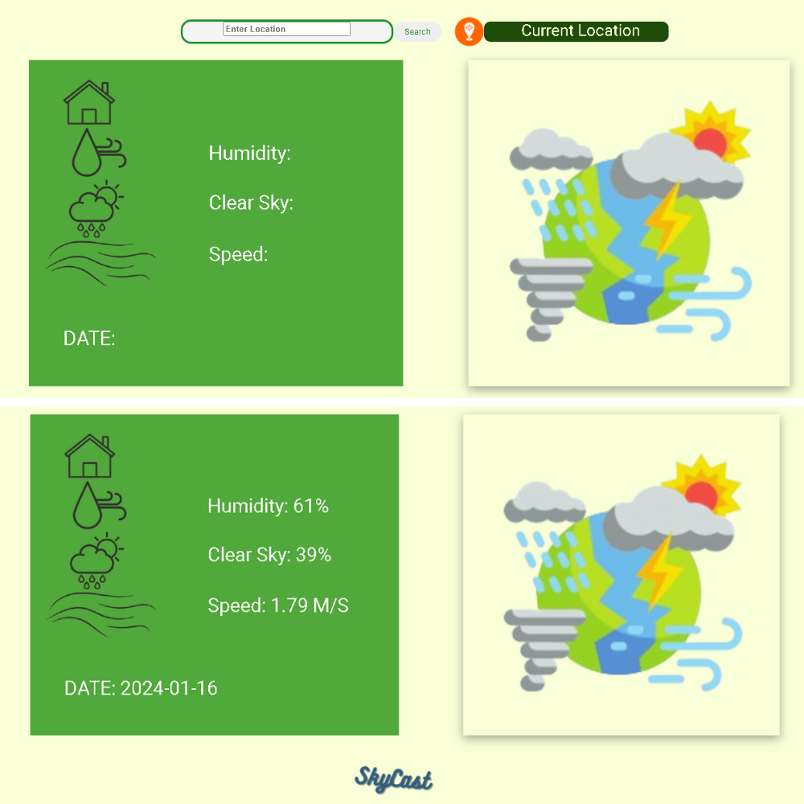

# SkyCast Site



## Overview

This is the official repository for the Weather Site, a simple weather website where users can input their location and get real-time weather information.

## Features

- **Location Input:** Click on the input field to type your location.
- **Real-Time Weather Information:** Retrieve and display current weather data based on user input.

## Getting Started

1. Clone the repository:

   ```bash
   git clone https://github.com/your-username/your-weather-site.git

## Usage
Click on the input field to enter your location.
Press "Search" to fetch and display real-time weather information.

## Technologies Used
HTML
CSS

## Credits
Weather data provided by Weather API

## License
This project is licensed under the MIT License.

## Contributing 🤝

If you have suggestions or find any issues, feel free to open an issue or create a pull request. Contributions are welcome!

## License 📄

This project is licensed under MIT License - see the [LICENSE](LICENSE) file for details.

## Show Your Support ⭐

If you find this project useful, consider giving it a star on GitHub. It's a small gesture that means a lot!

⭐ [Star this Repository](https://github.com/maltsh/Weather-Site)

